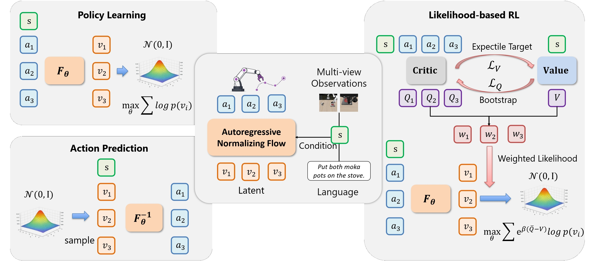

# RoMAN-Flow

<div align="center">

[](LICENSE)
[](#)
[](#)
[](videos/libero_long.mp4)
[](videos/robomimic_square.mp4)
[](videos/metaworld_hand_insert.mp4)

</div>

## Overview



## Environment

RoMAN-Flow requires Linux, Python 3.10, PyTorch 2.4.x built with CUDA 12.3,
and the following simulator/runtime versions:

- MuJoCo `2.3.7`
- Robosuite `1.4.0`
- RoboMimic `0.5.0` when using RoboMimic environments
- NumPy `1.26.x`

Install the system libraries and Python dependencies with:

```bash
export WORKSPACE_ROOT=/path/to/workspace
cd "$WORKSPACE_ROOT"

apt-get update
apt-get install -y \
  libosmesa6 libosmesa6-dev libgl1-mesa-glx libgl1-mesa-dri \
  libglfw3 libglew2.2

cd "$WORKSPACE_ROOT/RoMAN-Flow"
bash setup_env.sh

python tools/convert_clip_to_safetensors.py \
  --source-model-path="$WORKSPACE_ROOT/clip-vit-base-patch32" \
  --output-model-path="$WORKSPACE_ROOT/clip-vit-base-patch32-safetensors" \
  --trust-local-pickle

cd "$WORKSPACE_ROOT/LIBERO"
python -m pip install -e . --no-deps

cd "$WORKSPACE_ROOT/RoMAN-Flow"
export CODE_ROOT="$PWD"
export LIBERO_ROOT="$WORKSPACE_ROOT/LIBERO"
export LIBERO_CONFIG_PATH="$WORKSPACE_ROOT/.libero"
export PYTHONPATH="$CODE_ROOT:$LIBERO_ROOT:${PYTHONPATH:-}"
export MUJOCO_GL=osmesa
export PYOPENGL_PLATFORM=osmesa
export TOKENIZERS_PARALLELISM=false
export CLIP_MODEL_PATH="$WORKSPACE_ROOT/clip-vit-base-patch32-safetensors"

# Set CUDA_VISIBLE_DEVICES for the GPUs allocated by your scheduler or host.
```

For LIBERO-only runs, skip RoboMimic with
`INSTALL_ROBOMIMIC=0 bash setup_env.sh`, then install LIBERO with
`python -m pip install -e . --no-deps`. Do not install LIBERO's
`requirements.txt`; it pins the incompatible `robomimic==0.2.0`.

RoboMimic runs require version 0.5.0 from a local wheel
(`ROBOMIMIC_WHEEL`) or source checkout (`ROBOMIMIC_SOURCE_DIR`). It is
installed with `--no-deps` to avoid conflicts with SmolVLM. For multi-node runs,
use the same wheel from shared storage on every node.

The release supports the official LIBERO-10, LIBERO-Spatial, LIBERO-Object,
LIBERO-Goal datasets and RoboMimic Lift/Can/Square-MH. Transport-MH is outside
the supported scope.

MetaWorld data preparation and training support will be released in an upcoming
update.

## Release Architectures

RoMAN-Flow intentionally exposes two checkpoint-compatible image architectures:

- LIBERO uses `conditioning_mode=context`, IMPALA actor/critic encoder names,
  and `vlm_fuse=True`. SmolVLM produces the actor's visual-language context;
  the CLIP text tower conditions critic/value networks.
- RoboMimic uses `conditioning_mode=vision_context`, two spatial ResNet-18
  camera encoders, and no VLM or language conditioning.

## External Checkpoints

Model checkpoints are distributed separately and are intentionally not included
in this source-only repository. Set `WEIGHTS_ROOT` to the local checkpoint
artifact when running evaluation or One-Step training, and pass its checkpoint
root and manifest explicitly to `scripts/evaluate.py`.

```bash
export WEIGHTS_ROOT=/path/to/romanflow_weights
```

## LIBERO-Long

LIBERO-Long uses the `libero_10` HDF5 files. Set the data and model paths:

```bash
export LIBERO_DATA_ROOT=/path/to/libero_data
export SMOLVLM_MODEL_PATH=/path/to/SmolVLM-500M-Instruct
export CLIP_MODEL_PATH=/path/to/clip-vit-base-patch32-safetensors
export LIBERO10_HDF5="$LIBERO_DATA_ROOT/libero_10/*.hdf5"
export LIBERO10_BUFFER="$LIBERO_DATA_ROOT/libero_10/romanflow_libero10_langsmolvlm_proprio.zarr"
export EVAL_HDF5="$LIBERO_DATA_ROOT/libero_10/<task>_demo.hdf5"
export EVAL_BUFFER="$LIBERO_DATA_ROOT/libero_10/romanflow_<task>_langsmolvlm_proprio.zarr"
```

Build the training buffer and one task-specific evaluation buffer. The second
command reuses training-suite proprioception statistics for rollout:

```bash
cd "$CODE_ROOT"
python scripts/prepare_libero_buffer.py \
  --dataset="$LIBERO10_HDF5" --buffer="$LIBERO10_BUFFER" \
  --model-path="$SMOLVLM_MODEL_PATH"
python scripts/prepare_libero_buffer.py \
  --dataset="$EVAL_HDF5" --buffer="$EVAL_BUFFER" \
  --model-path="$SMOLVLM_MODEL_PATH" \
  --stats-source-buffer="$LIBERO10_BUFFER"
```

Run IL on one node with 16 GPUs:

The shared options below list only values that differ from the release defaults.

```bash
cd "$CODE_ROOT"
export EXP_ROOT="$CODE_ROOT/exp"
export RUN_GROUP=romanflow_libero10_il

COMMON=(
  --env_name=libero_10
  --dataset_dir="$LIBERO10_HDF5"
  --libero_buffer_path="$LIBERO10_BUFFER"
  --seed=1
  --agent.actor_encoder=impala
  --agent.impala_adaptive_pool_hw=16,16
  --agent.critic_prefix_reduce=mean
  --agent.q_agg=mean
  --agent.discount=0.995
  --agent.bc_rep_size=1152
  --agent.smolvlm_model_path="$SMOLVLM_MODEL_PATH"
  --agent.language_model_path="$CLIP_MODEL_PATH"
  --agent.use_proprioception=True
  --agent.critic_use_language_conditioning=True
  --agent.value_use_language_conditioning=True
  --agent.share_critic_value_state=True
  --agent.alpha_actor=1.0
  --global_batch_size=64
  --batch_prefetch=True
  --ddp=True
  --ddp_static_graph=False
  --ddp_find_unused_parameters=True
  --log_interval=100
  --eval_interval=0
)

torchrun --standalone --nnodes=1 --nproc_per_node=16 \
  main_torch.py "${COMMON[@]}" \
  --run_group="$RUN_GROUP" \
  --agent.train_mode=il \
  --agent.lr=5e-5 --agent.actor_lr=5e-5 \
  --offline_steps=20000 --save_interval=20000
```

Run IQL from the final IL checkpoint:

```bash
cd "$CODE_ROOT"
export IL_CKPT="$(find "$EXP_ROOT/fql-orl-torch/$RUN_GROUP" \
  -name params_20000.pt -print -quit)"
export IQL_GROUP=romanflow_libero10_iql

torchrun --standalone --nnodes=1 --nproc_per_node=16 \
  main_torch.py "${COMMON[@]}" \
  --run_group="$IQL_GROUP" --pretrain_path="$IL_CKPT" \
  --agent.iql_temperature=10.0 \
  --agent.use_hubl=True --agent.hubl_alpha=0.2 \
  --agent.actor_lr=2e-5 \
  --offline_steps=50000 --save_interval=10000
```

Run One-Step distillation from the final IQL checkpoint using the exact
released stage configuration:

```bash
export IQL_CKPT="$(find "$EXP_ROOT/fql-orl-torch/$IQL_GROUP" \
  -name params_50000.pt -print -quit)"
export ONE_STEP_GROUP=romanflow_libero10_one_step
export ONE_STEP_FLAGS="$WEIGHTS_ROOT/checkpoints/libero_long/one_step/flags.json"

torchrun --standalone --nnodes=1 --nproc_per_node=16 \
  main_torch.py "${COMMON[@]}" \
  --run_group="$ONE_STEP_GROUP" --pretrain_path="$IQL_CKPT" \
  --agent_flags_json="$ONE_STEP_FLAGS" \
  --biflow_align_steps=20000 \
  --save_interval=20000
```

Evaluate one LIBERO-Long task with the final IQL checkpoint. Set `EVAL_HDF5`
to any one of the ten task files; repeat the command for all tasks if needed.

```bash
cd "$CODE_ROOT"
export IQL_CKPT="$(find "$EXP_ROOT/fql-orl-torch/$IQL_GROUP" \
  -name params_50000.pt -print -quit)"
export IQL_FLAGS="$(dirname "$IQL_CKPT")/flags.json"
python eval_biflow_torch.py \
  --checkpoint="$IQL_CKPT" --flags_json="$IQL_FLAGS" \
  --env_name=libero_10 --dataset_dir="$EVAL_HDF5" \
  --libero_buffer_path="$EVAL_BUFFER" \
  --smolvlm_model_path="$SMOLVLM_MODEL_PATH" \
  --language_model_path="$CLIP_MODEL_PATH" \
  --action_exec_horizon=16 --temperature=0.5 --cfg=0.6 \
  --apply_denoising=false \
  --output=libero10_iql_eval.csv \
  --episode_output=libero10_iql_eval.episodes.json
```

The same preparation, training, and evaluation commands apply to the other
official suites. Replace `libero_10` consistently with `libero_spatial`,
`libero_object`, or `libero_goal`, and point `dataset_dir` and the Zarr buffer
at that suite's local files. A rollout `dataset_dir` must be one task HDF5;
training may use a quoted suite glob.

## Release Evaluation

`scripts/evaluate.py` is the batch launcher for released checkpoints. It does
not install dependencies, infer machine roles, or write outputs into this
repository. Build the per-task rollout buffers first, then choose an external
output directory and the CUDA devices available on the current machine.

The following prepares the four suite-level training buffers and all 40
task-level rollout buffers in a user-selected location. The rollout buffers
reuse the corresponding suite statistics.

```bash
export LIBERO_EVAL_BUFFERS=/path/to/libero_eval_buffers

for suite in libero_10 libero_spatial libero_object libero_goal; do
  suite_dir="$LIBERO_DATA_ROOT/$suite"
  source_buffer="$LIBERO_EVAL_BUFFERS/$suite/training.zarr"
  python scripts/prepare_libero_buffer.py \
    --dataset="$suite_dir/*.hdf5" --buffer="$source_buffer" \
    --model-path="$SMOLVLM_MODEL_PATH"
  for task in "$suite_dir"/*.hdf5; do
    stem="$(basename "$task" .hdf5)"
    python scripts/prepare_libero_buffer.py \
      --dataset="$task" --buffer="$LIBERO_EVAL_BUFFERS/$suite/$stem.zarr" \
      --model-path="$SMOLVLM_MODEL_PATH" \
      --stats-source-buffer="$source_buffer"
  done
done
```

```bash
export RESULTS_ROOT=/path/to/romanflow_results/libero_release

COMMON_LIBERO_EVAL=(
  --benchmark=libero
  --data-root="$LIBERO_DATA_ROOT"
  --buffer-root="$LIBERO_EVAL_BUFFERS"
  --checkpoint-root="$WEIGHTS_ROOT/checkpoints"
  --manifest="$WEIGHTS_ROOT/manifest.json"
  --output-root="$RESULTS_ROOT"
  --smolvlm-model-path="$SMOLVLM_MODEL_PATH"
  --clip-model-path="$CLIP_MODEL_PATH"
)

python scripts/evaluate.py "${COMMON_LIBERO_EVAL[@]}" \
  --devices=0,1,2,3
```

For a multi-machine run, use the same data, buffer, checkpoint, and output
paths on every machine, but assign disjoint shards explicitly. After all
shards complete, create one summary from any machine:

```bash
python scripts/evaluate.py "${COMMON_LIBERO_EVAL[@]}" --devices=0,1 --shard-count=2
python scripts/evaluate.py "${COMMON_LIBERO_EVAL[@]}" --devices=0,1 --shard-index=1 --shard-count=2
python scripts/evaluate.py "${COMMON_LIBERO_EVAL[@]}" --summarize-only
```

RoboMimic uses the same launcher and explicit sharding. Its buffer root is the
RoboMimic data root because each task buffer lives under `<task>/mh/`:

```bash
python scripts/evaluate.py \
  --benchmark=robomimic \
  --data-root="$ROBOMIMIC_DATA_ROOT" \
  --buffer-root="$ROBOMIMIC_DATA_ROOT" \
  --checkpoint-root="$WEIGHTS_ROOT/checkpoints" \
  --manifest="$WEIGHTS_ROOT/manifest.json" \
  --output-root=/path/to/romanflow_results/robomimic_release \
  --devices=0,1,2,3
```

RoboMimic defaults to the released IQL and One-Step checkpoints. Add
`--stages=il,iql,one_step` when IL checkpoints should also be evaluated.

## RoboMimic

Prepare the local official Lift/Can/Square-MH state files, convert them to the
two-view image schema when needed, validate the result, and build Zarr caches:

```bash
export ROBOMIMIC_DATA_ROOT=/path/to/robomimic_data
python scripts/prepare_robomimic.py --data-root="$ROBOMIMIC_DATA_ROOT"

export ROBOMIMIC_HDF5="$ROBOMIMIC_DATA_ROOT/square/mh/image_v141.hdf5"
export ROBOMIMIC_BUFFER="$ROBOMIMIC_DATA_ROOT/square/mh/image_v141_romanflow.zarr"
```

Each task directory must contain the local official `mh/demo_v141.hdf5`, or an
already converted `mh/image_v141.hdf5`. No dataset download is performed.

Train IL and then IQL on one node with 16 GPUs:

The shared options below list only values that differ from the release defaults.

```bash
cd "$CODE_ROOT"
export EXP_ROOT="$CODE_ROOT/exp"
export RUN_GROUP=romanflow_square_mh_il
export IQL_GROUP=romanflow_square_mh_iql

COMMON=(
  --env_name=robomimic_square_mh
  --dataset_dir="$ROBOMIMIC_HDF5"
  --robomimic_buffer_path="$ROBOMIMIC_BUFFER"
  --agent.actor_encoder=robomimic_spatial_resnet18
  --agent.critic_encoder=robomimic_spatial_resnet18
  --agent.critic_prefix_reduce=mean
  --agent.q_agg=mean --agent.discount=0.997 --agent.tau=0.05
  --agent.bc_rep_size=1152 --agent.conditioning_mode=vision_context
  --agent.vlm_fuse=False --agent.use_language_conditioning=False
  --agent.cfg=0.0 --agent.eval_temperature=0.7
  --agent.alpha_actor=1.0
  --obs_horizon=1 --action_horizon=10 --global_batch_size=64
  --ddp=True --ddp_static_graph=False --ddp_find_unused_parameters=True
  --log_interval=100 --eval_interval=0
)

torchrun --standalone --nnodes=1 --nproc_per_node=16 \
  main_torch.py "${COMMON[@]}" --run_group="$RUN_GROUP" \
  --agent.train_mode=il --offline_steps=30000 --save_interval=10000

export IL_CKPT="$(find "$EXP_ROOT/fql-orl-torch/$RUN_GROUP" \
  -name params_30000.pt -print -quit)"

torchrun --standalone --nnodes=1 --nproc_per_node=16 \
  main_torch.py "${COMMON[@]}" --run_group="$IQL_GROUP" \
  --pretrain_path="$IL_CKPT" \
  --agent.iql_expectile=0.75 --agent.iql_temperature=10.0 \
  --agent.iql_adv_clip=20.0 \
  --agent.iql_critic_warmup_steps=5000 \
  --agent.use_hubl=True --agent.hubl_alpha=0.15 \
  --agent.lr=2e-4 \
  --offline_steps=50000 --save_interval=25000
```

Run One-Step distillation from the final IQL checkpoint:

```bash
export IQL_CKPT="$(find "$EXP_ROOT/fql-orl-torch/$IQL_GROUP" \
  -name params_50000.pt -print -quit)"
export ONE_STEP_GROUP=romanflow_square_mh_one_step
export ONE_STEP_FLAGS="$WEIGHTS_ROOT/checkpoints/robomimic_square/one_step/seed0/flags.json"

torchrun --standalone --nnodes=1 --nproc_per_node=16 \
  main_torch.py "${COMMON[@]}" --run_group="$ONE_STEP_GROUP" \
  --pretrain_path="$IQL_CKPT" --agent_flags_json="$ONE_STEP_FLAGS" \
  --biflow_align_steps=20000 \
  --save_interval=20000
```

Evaluate the final RoboMimic IQL checkpoint:

```bash
export IQL_CKPT="$(find "$EXP_ROOT/fql-orl-torch/$IQL_GROUP" \
  -name params_50000.pt -print -quit)"
export IQL_FLAGS="$(dirname "$IQL_CKPT")/flags.json"

python eval_biflow_torch.py \
  --checkpoint="$IQL_CKPT" --flags_json="$IQL_FLAGS" \
  --env_name=robomimic_square_mh --dataset_dir="$ROBOMIMIC_HDF5" \
  --robomimic_buffer_path="$ROBOMIMIC_BUFFER" --eval_episodes=100 \
  --action_exec_horizon=10 --temperature=0.7 --cfg=0.0 \
  --apply_denoising=false --fixed_episode_seeds=true \
  --output=robomimic_square_mh_iql_eval.csv \
  --episode_output=robomimic_square_mh_iql_eval.episodes.json
```

For Lift-MH or Can-MH, replace `square` in the local paths and use
`robomimic_lift_mh` or `robomimic_can_mh`. The entry points verify the HDF5
`env_args` metadata before training or rollout, so a task name cannot silently
select another task's dataset.
